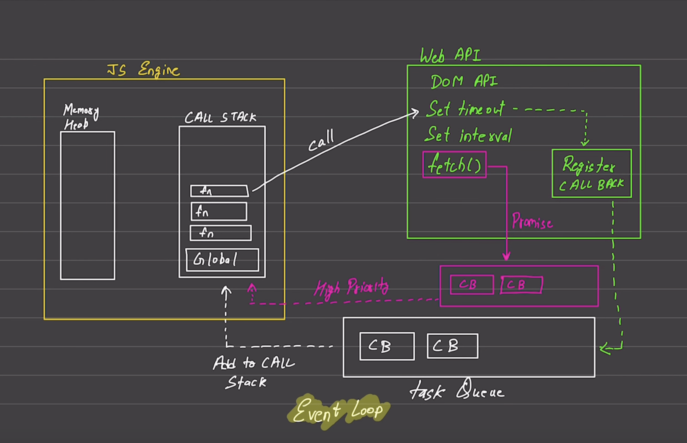

# Asynchronous Javascript

* Javascript is Synchronous and Single Threaded
* Each operation waits for the last one to complete before executing

### Blocking Code and Non-Blocking Code

* Blocking Code
    - blocks the flow of program
    - Ex: Read file sync
* Non-Blocking Code 
    - Doesn't block execution
    - Ex: Read file async

